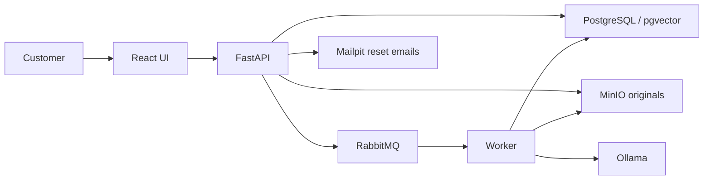

# HomeFlow

Customer mortgage application, document upload/vault, password accounts, and a background document-processing pipeline. This is a local development project; the complete LLM workflow still needs end-to-end accuracy and integration testing.

## 1. Install prerequisites

Everyone needs **Git** and **Docker with Compose v2**. No separate Node, Python, database, queue, storage, or Ollama installation is required for the Docker setup.

- Git: https://git-scm.com/downloads
- Docker Desktop: https://docs.docker.com/desktop/setup/install/
- Windows: use Linux containers and the WSL 2 backend; follow https://docs.docker.com/desktop/setup/install/windows-install/ . Restart when the installer asks, then open Docker Desktop.
- macOS: install Docker Desktop for your chip (Apple Silicon or Intel).
- Linux: Docker Desktop, or Docker Engine plus the Compose plugin: https://docs.docker.com/engine/install/ . Your user must have permission to run Docker.

Verify in a terminal:

```text
git --version
docker --version
docker compose version
docker info
```

The AI models are large downloads and CPU inference can be slow. As a practical starting point, plan for 32 GB host RAM and at least 30 GB free disk space, with adequate Docker memory allocation; these are planning estimates, not validated minimums. A GPU is optional. Docker defaults to CPU in this repository. See https://docs.ollama.com/docker for GPU configuration. Basic UI/accounts testing can skip model downloads.

## 2. Clone the repository

Clone the team repository:

```text
git clone https://github.com/Manojba1302/BUAN-6390-.git HomeFlow
cd HomeFlow
```

Run all commands from this repository root (where docker-compose.yml is located). Never use somebody else's absolute Desktop path.

## 3. First-time setup

Windows PowerShell:

```powershell
powershell -NoProfile -ExecutionPolicy Bypass -File .\scripts\setup.ps1
```

macOS/Linux terminal:

```bash
bash scripts/setup.sh
```

The script checks Docker, creates a private `.env` if missing, validates Compose, starts containerized Ollama, downloads the three default models, builds services, and starts the stack. The first run can take substantial time. Any failed Docker command stops the script; resolve its error and rerun safely. It preserves existing `.env` and database volumes.

For UI/accounts only, skip model downloads:

```powershell
powershell -NoProfile -ExecutionPolicy Bypass -File .\scripts\setup.ps1 -SkipModels
```

```bash
bash scripts/setup.sh --skip-models
```

AI classification/extraction/chat will be unavailable until the models are pulled. This mode uses the real API, not mock data.

The scripts download `llama3.2-vision:11b`, `llama3.1:8b`, and `nomic-embed-text`. If you change model settings, pull those additional model names yourself. Do not change the embedding model without handling its vector dimensions and reindexing stored data.

## 4. Open and test

| Service | URL |
|---|---|
| HomeFlow | http://localhost:5173 |
| API documentation | http://localhost:8000/docs |
| API liveness | http://localhost:8000/api/v1/health |
| Partial readiness check | http://localhost:8000/api/v1/ready |
| Password-reset emails (local only) | http://localhost:8025 |
| RabbitMQ console | http://localhost:15672 |
| MinIO console | http://localhost:9001 |
| Ollama on host | http://localhost:11435 |

1. Create an account using a new test email and a password of at least 9 characters, including uppercase, lowercase, a number and a symbol (such as `@`).
2. Confirm the profile shows your identity and customer ID.
3. Log out and back in.
4. Request a reset link. Open the message in Mailpit at port 8025 and follow the link. Reset links expire after 30 minutes and revoke previous sessions.
5. Upload fictional/sample documents, inspect their status, and check worker logs. Do not commit customer documents to Git.

Old email-only demo customer rows cannot be claimed by registration. Use a new email; verified legacy-account migration is a separate task. Email verification and MFA are not implemented. The local email inbox does not send mail to real recipients.

`ready` currently checks database and Ollama connectivity only; it does not prove models are installed, storage/queue health, or extraction accuracy.

## 5. Daily commands

Windows:

```powershell
.\scripts\homeflow.ps1 start
.\scripts\homeflow.ps1 status
.\scripts\homeflow.ps1 logs
.\scripts\homeflow.ps1 test
.\scripts\homeflow.ps1 stop
```

macOS/Linux:

```bash
bash scripts/homeflow.sh start
bash scripts/homeflow.sh status
bash scripts/homeflow.sh logs
bash scripts/homeflow.sh test
bash scripts/homeflow.sh stop
```

If PowerShell blocks scripts, invoke them with the same process-scoped `powershell -ExecutionPolicy Bypass -File ...` command as setup. No global execution-policy change is necessary.

Equivalent manual commands:

```text
docker compose -f docker-compose.yml -f compose.auth.yml --profile models up --build -d
docker compose -f docker-compose.yml -f compose.auth.yml --profile models ps
docker compose -f docker-compose.yml -f compose.auth.yml --profile models logs -f backend worker
docker compose -f docker-compose.yml -f compose.auth.yml --profile models down
```

Stopping preserves named volumes containing accounts, documents, models, and markdown. Do not add `-v` unless you intentionally want to erase local data. The Compose project and package name are `homeflow`. Fresh clones create HomeFlow-named containers and volumes. Existing installations can retain their old Compose project/volumes via the private COMPOSE_PROJECT_NAME setting in .env; do not rename or delete initialized volumes. Existing .env credentials override the new HomeFlow defaults.

## 6. Configuration and troubleshooting

`.env.example` contains local development defaults. `.env` contains your private configuration and is ignored by Git. Never commit real passwords or mail credentials. Database/queue/storage defaults are for local development only; all published ports bind to localhost.

- Missing `.env`: setup creates it, or copy `.env.example` to `.env` yourself.
- Existing old `.env`: set `OLLAMA_BASE_URL=http://ollama:11434` for the standard containerized setup. Remove obsolete `DEV_AUTH`; it is no longer used.
- Ports already occupied: stop the conflicting local service or change the corresponding `WEB_PORT`, `API_PORT`, `DB_PORT`, `QUEUE_PORT`, `QUEUE_UI_PORT`, `STORAGE_PORT`, `STORAGE_UI_PORT`, or `OLLAMA_PORT` in `.env`. For frontend/API port changes also update `FRONTEND_URL`, `CORS_ORIGINS`, and `VITE_API_BASE`, then rebuild. Internal container ports stay unchanged. Mailpit uses port 8025; change compose.auth.yml if needed.
- MinIO image unavailable: this repository builds a pinned MinIO source release in `infra/minio/Dockerfile`; it does not depend on removed `minio/minio:latest` images or images on a teammate's machine.
- Reset email absent: check Mailpit is running and backend logs. Compose defaults use `SMTP_HOST=mailpit`, port 1025, without TLS. Deployment needs real SMTP, HTTPS, `COOKIE_SECURE=true`, and appropriate allowed origins.
- AI unavailable: inspect `docker compose --profile models exec ollama ollama list`; pull missing models using `docker compose --profile models exec ollama ollama pull MODEL_NAME`. CPU processing may exceed existing request timeouts.
- Changed database passwords do not update an already initialized PostgreSQL volume. Keep credentials consistent or perform a deliberate database password migration.
- SQL initialization scripts run only on a fresh PostgreSQL volume. Auth tables are added at API startup; later database schema changes need migrations.
- Login errors: inspect backend logs and use the same `localhost` hostname consistently; do not mix it with `127.0.0.1` in one session.

## 7. Folder map

- `frontend/`: React/TypeScript UI, login and account screens.
- `backend/`: FastAPI endpoints, authentication, database models and tests.
- `worker/`: queued document processing.
- `shared/`: document definitions and processing helpers used by API/worker.
- `db/init/`: initial PostgreSQL/pgvector schema and seed data.
- `infra/minio/`: portable storage image build.
- `scripts/`: setup and daily commands.
- `SPECIFICATIONS.md`: technologies/models and current limitations.

## 8. Before pushing to GitHub

Commit source, Dockerfiles, compose files, scripts, lockfiles, docs, and `.env.example`. `.gitignore` excludes private environment files, generated caches/builds, logs, screenshots, and uploaded data. Do not put real borrower information in source fixtures.

```text
git status --short
git check-ignore .env
```

If this folder is not a Git repository, run `git init` first. Review staged files before committing. Git ignore rules do not untrack an already committed secret; rotate any exposed credentials. Do not push generated Docker volumes, model weights, node_modules, or virtual environments.

## Verification status

Frontend build and isolated authentication tests passed on the developer machine. Authentication tests use a temporary SQLite database and a test mail sender; they do not validate live PostgreSQL/SMTP delivery. Compose configuration is validated. Fresh-machine builds, macOS/Linux startup, GPU performance, and the full LLM pipeline still need team testing; model latency budgets are goals, not measured guarantees.


## 9. How HomeFlow works

### Services and responsibilities

| Component | What it does | Where its data lives |
|---|---|---|
| React frontend | Account screens, six application sections, conditional income questions, upload preview, document vault, extraction review and progress | Saved answers come from the API; temporary UI state is not a substitute for saving |
| FastAPI backend | Authenticates requests, checks document/application ownership, validates inputs, saves answers, accepts uploads and exposes document/chat endpoints | PostgreSQL metadata; document bytes in MinIO |
| PostgreSQL + pgvector | Stores customers, applications, answers, authentication, document metadata, extracted evidence and searchable vectors | Named database volume |
| RabbitMQ | Hands accepted document jobs to the background worker so processing does not block the application form | Named queue volume |
| Worker | Reads PDFs/images, attempts OCR, classifies, extracts fields, creates markdown and embeddings, and updates processing status | Writes results to PostgreSQL and configured storage |
| MinIO | Stores original uploaded file bytes in S3-compatible object storage | Named storage volume |
| Ollama | Runs local vision, text-generation and embedding models | Model downloads persist in the Ollama volume |
| Mailpit | Captures local password-reset messages for development | Local inbox; it does not deliver real email |



Ollama is the model runtime, not the entire document system. HomeFlow code performs file validation, page preparation, ownership checks, field mapping and storage. Vision handles image/scanned content; the text model handles readable text and structured responses; the embedding model turns document chunks and questions into vectors for retrieval. Models can return incorrect or incomplete results, so extraction review remains necessary.

### Account and application workflow

1. **Create account:** enter names, email and a password of 9–128 characters with uppercase, lowercase, a digit and a non-whitespace symbol such as `@`. Registration and password reset enforce this server-side. Existing accounts can still sign in with their original passwords.
2. **Authenticated session:** the backend creates a customer ID and a server-side session. The browser receives an HttpOnly, SameSite cookie. Passwords are stored as salted scrypt hashes, not plaintext. Sessions last eight hours; logout invalidates the server token.
3. **Application:** an application ID identifies a particular application owned by that customer. The customer ID is shown in the profile; application ID and completion progress belong to the application. They are separate identifiers.
4. **Get started:** capture the home goal, contact/property basics and employment situation. Employment selection changes the relevant income questions and document requests.
5. **Documents:** add identification and financial evidence, then review the processing results. Current core document types are driver’s license, Social Security card, bank statement, payslip and W-2. Income document requirements depend on the selected employment situation.
6. **About you / Property / Income & finances:** complete the appropriate application questions and save changes. The SSN input is visible while editing and masked afterward in the UI; masking is a display behavior, not encryption.
7. **Review:** inspect answers, missing requirements and document-derived values before submitting. Submission here is an application record action; it does not automatically deliver a loan to an external lender.
8. **Resume:** sign in again to access your own saved applications and documents. Another customer's identifiers do not grant access.

### Document workflow, including scans

1. Select the intended document type and choose a supported PDF/image. Preview helps the customer inspect the selected file.
2. Preview is local for selected PDF/image files. Classification starts on the backend only after the customer presses Submit; no classify request is made on file selection.
3. HomeFlow compares the selected type with detected content and reports uncertainty, disagreement or mixed documents. Classification currently inspects up to the first six pages, so it does not guarantee detection of every document in a long mixed PDF.
4. After Submit, the selected file is classified. Mismatched/unknown files remain available for review; successful uploads are removed from staging while failures remain for retry. The accepted upload creates a file ID, ownership/application metadata, storage key, checksum and processing status; the original bytes are stored in MinIO and a job is queued.
5. The worker reads embedded PDF text where available. For scans/images, it prepares page images and attempts OCR; vision provides another path when usable text is unavailable.
6. Classification/extraction combine model responses with document definitions and parsing logic. Extracted values retain provenance such as page, evidence, method and review state where available.
7. The pipeline produces markdown and searchable document chunks/embeddings. The API exposes status and extraction results; the customer reviews/corrects values before relying on prefilled application answers.
8. The vault lists saved documents and their status. An upload existing in storage does not mean extraction has finished successfully. Inspect status/error details and worker logs when a file remains pending or fails.

### Document chat / retrieval

The chat API retrieves relevant document chunks within the authenticated customer's scope, then uses the text model to answer from that context. Retrieval requires successfully processed and embedded documents. Test the endpoint through API documentation with an authenticated session. A complete polished customer chat experience and banker portal are not established by the presence of this API; assess those separately before demonstrating them as finished features.

### Database and ownership model

- `customer` stores customer identity; `auth_account` stores password hashes and login lockout state.
- `auth_session` stores hashed session tokens and expiry; `password_reset` stores single-use reset-token records. Resetting a password revokes existing sessions.
- `application` belongs to a customer; `application_field` stores saved values, their source and review/provenance details.
- `file` belongs to a customer and may reference an application. It stores metadata and a storage key rather than the original binary in PostgreSQL.
- `file_classification` records selected/detected type, outcome and evidence; `extraction` records document-derived field values. Additional schema tables support financial/application entities and retrieval.

Use `db/init/001_schema.sql` and backend ORM models as the detailed schema reference. Customer/application IDs are generated identifiers, not SSNs. Never infer access rights from frontend filtering alone; protected API routes perform ownership checks.

## 10. Source guide for developers

| Path | Start here when changing… |
|---|---|
| `frontend/src/AuthPage.tsx` | Login, registration, recovery, password visibility and requirements |
| `frontend/src/App.tsx` | Application navigation, identity, forms and UI state |
| `frontend/src/api.ts` | Browser/API requests and session handling |
| `frontend/src/bank-layout.css` | Application and account layout/theme |
| `frontend/src/icons.tsx` | Shared SVG icon system |
| `backend/app/api/v1/auth.py` | Registration, login, reset email and password rules |
| `backend/app/core/security.py` | Password hashing, session lookup and origin checks |
| `backend/app/api/v1/applications.py` | Owned applications, saving and progress |
| `backend/app/api/v1/documents.py` | Classification, upload, status, extraction corrections and content |
| `backend/app/api/v1/chat.py` | Document retrieval and answers |
| `backend/app/db/models.py` | ORM/table mapping |
| `worker/worker/main.py` | Queue consumption and processing orchestration |
| `worker/worker/pipeline.py` | Reading, OCR, classification, extraction and embeddings |
| `shared/pages.py` | PDF/image page preparation |
| `shared/doc_types.py`, `shared/document_types.json` | Supported document definitions and classification rules |
| `shared/ollama.py` | Model HTTP calls and response handling |
| `.env.example` | Team configuration template |
| `docker-compose.yml`, `compose.auth.yml` | Service wiring, volumes, ports and local reset-email service |

## 11. Team verification checklist

After first startup, use `scripts/homeflow.ps1 test` (Windows) or `bash scripts/homeflow.sh test` (macOS/Linux) for isolated authentication checks. Then verify the actual running stack:

- Register, sign out, sign in and recover a password through Mailpit.
- Save answers, refresh and confirm the correct account/application loads.
- Upload fictional examples of each supported type, including a scanned PDF and a long/mixed PDF. Check detected type, extraction evidence and failure handling.
- Correct an extracted value and confirm the saved application reflects the intended reviewed answer.
- Use a second account to verify that the first account's application/documents remain inaccessible.
- Confirm models are installed with `docker compose --profile models exec ollama ollama list` and inspect worker logs during processing.

The authentication suite covers ownership, session expiry/logout, reset replay, rate limits and password rules in an isolated database. It does not prove document accuracy or live SMTP/database integration. Keep model evaluation results separate from build/test success.

## 12. Troubleshooting by workflow

| Symptom | First checks |
|---|---|
| Browser cannot open HomeFlow | Docker running; Compose `ps`; frontend logs; correct WEB_PORT |
| Account request fails | Backend logs; database health; allowed origin; consistent localhost hostname |
| Reset link never appears | Mailpit/backend running; SMTP configuration; inspect local inbox; repeated requests may be limited |
| Upload fails immediately | Supported file type/size; API error details; storage service; signed-in session |
| Upload stays pending | Worker running; RabbitMQ connectivity; worker logs |
| Classification says unknown | Readable scan, available model, timeout/error logs; confirm document type manually where allowed |
| AI processing is slow | CPU/model size, Docker RAM, missing models and request timeouts |
| Chat has no useful evidence | Documents finished processing; chunks/embeddings exist; correct account/application scope |
| Old data seems missing | Compose project name and volume names match the previous installation |

For a code update after pulling from GitHub, rerun the normal `start` command to rebuild. Read schema changes before updating an existing database: initialization SQL is not a migration system. Back up existing named volumes before any deliberate destructive reset. No setup script automatically deletes customer data.

Account creation and password reset include a confirm-password field with live matching feedback. The UI shows missing requirements and supports show/hide for both fields. The symbol requirement accepts printable ASCII punctuation from the [OWASP reference](https://community.owasp.org/password-special-characters). Spaces may occur but do not satisfy this requirement. This is HomeFlow policy, not an OWASP certification. The account screen uses a full-screen home-photo background.

## Source-based document collection

The supplied Consumer_RE_Requirements_and_Flow.html (Application step 6 and rules R-UW-1/R-UW-3) specifies two latest paystubs, two years of W-2s and two months of bank statements per account for an owner-occupied W-2 purchase. The Oct 1 meeting notes additionally request Social Security card/driver’s-license categories and client-side preview before Submit. Build a multi.docx describes configurable checklists across products and tenants; it does not establish a universal three-month period.

Checklist file counts are collection indicators. They do not yet verify distinct statement months, all accounts/pages, or W-2 tax-year coverage. A combined multi-period PDF may require manual review; automatic period-aware completeness remains separate work. The UI keeps configured guidance visible after upload and shows local previews for images/PDFs before server submission. Saved documents open through their existing detail view.
